## Project Dockerization Overview

This repository contains four Node.js microservices:
- `user-service`
- `product-service`
- `order-service`
- `gateway-service`

Each service is containerized with its own `Dockerfile`, and Docker Compose is used to build and run all services together.

## Dockerfile Pattern

Each service Dockerfile follows the same optimized pattern:
- `FROM node:20-alpine` for a small production-ready Node runtime
- `WORKDIR /app`
- `COPY package*.json ./`
- `RUN npm install`
- `COPY . .`
- `EXPOSE <service-port>` (3000 for `user-service`, 3001 for `product-service`, 3002 for `order-service`, 3003 for `gateway-service`)
- `CMD ["node", "app.js"]`

This works well because each service is a plain Node.js application that starts directly from `app.js`.

## docker-compose.yml

The `docker-compose.yml` file builds each service from its respective folder:
- `build.context: ./user-service`
- `build.context: ./product-service`
- `build.context: ./order-service`
- `build.context: ./gateway-service`

The Compose file also ensures the gateway service starts after the backend services by using `depends_on`.

A shared network is defined, but Docker Compose would also provide service discovery automatically by default.

## Build and Run Instructions

From the `Microservices` folder, run:
```bash
docker-compose up --build
```

This command will:
- build the four service images
- create containers for each service
- attach them to the same Docker Compose network

To stop and remove containers, use:
```bash
docker-compose down
```

## Service Ports and Verification

Once running, verify each service as follows:

- `user-service`:
  - `http://localhost:3000/users`
- `product-service`:
  - `http://localhost:3001/products`
- `order-service`:
  - `http://localhost:3002/orders`
- `gateway-service`:
  - `http://localhost:3003/api/users`
  - `http://localhost:3003/api/products`
  - `http://localhost:3003/api/orders`

## Further Details on Docker

- Each microservice has its own Dockerfile and package manifest.
- The Compose file correctly builds each service from its directory.
- The gateway service is the only service that depends on the other three.
- The setup is simple and correct for this Node.js microservice demo.

## Prerequisites

- Docker Engine or Docker Desktop installed (Docker version >= 20.10 recommended).
- Docker Compose (v2 integrated with Docker CLI or standalone compose >= 1.29).
- Recommended: Node.js 18+ or 20+ and npm 8+ for local debugging (containers include runtime).

## File locations

- `user-service/Dockerfile` — builds the user service image
- `product-service/Dockerfile` — builds the product service image
- `order-service/Dockerfile` — builds the order service image
- `gateway-service/Dockerfile` — builds the gateway service image
- `docker-compose.yml` — located in this `Microservices` folder and composes all services

## Common Commands

From the `Microservices` folder:

```bash
# build all images and start (attached)
docker-compose up --build

# build and start in background
docker-compose up -d --build

# stop and remove containers
docker-compose down

# rebuild a single service (example: gateway)
docker-compose build gateway-service

# view logs (all services)
docker-compose logs -f

# view logs for a single service
docker-compose logs -f gateway-service

# remove dangling images and volumes (careful: frees space)
docker system prune -f
docker volume prune -f
```

## Health Checks & Test Examples

Use these `curl` commands to verify services. Expected responses are brief JSON arrays/objects.

- User service
```bash
curl http://localhost:3000/health
# expected: { "status": "User Service is healthy" }

curl http://localhost:3000/users
# expected: JSON array of users
```

- Product service
```bash
curl http://localhost:3001/health
# expected: { "status": "Product Service is healthy" }

curl http://localhost:3001/products
# expected: JSON array of products
```

- Order service
```bash
curl http://localhost:3002/health
# expected: { "status": "Order Service is healthy" }

curl http://localhost:3002/orders
# expected: JSON array of orders

curl -X POST http://localhost:3002/orders -H "Content-Type: application/json" -d '{"userId":1,"productId":2}'
# expected: created order JSON
```

- Gateway API (aggregator)
```bash
curl http://localhost:3003/api/users
curl http://localhost:3003/api/products
curl http://localhost:3003/api/orders
# expected: proxied responses from respective services
```

## Troubleshooting

- Port conflicts: if ports 3000-3003 are in use on the host, stop those services or change host-side mappings in `docker-compose.yml`.
- Container fails immediately: check container logs with `docker-compose logs <service>` and ensure `app.js` exists and `CMD` is correct.
- Build cache issues: force rebuild with `docker-compose build --no-cache`.
- Disk space problems: run `docker system df` and prune unused resources with `docker system prune`.

## Screenshots

Below are screenshots captured from a verified run. Image files are located in `Microservices/images/`.

- **Test a Dockerfile Build**

  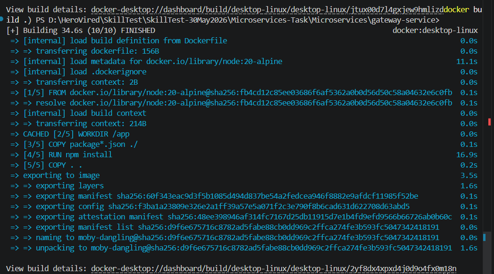
  
  _File:_ `Microservices/images/gateway-service-docker-build.png` — shows the gateway image build output.

- **Docker Compose Build**

    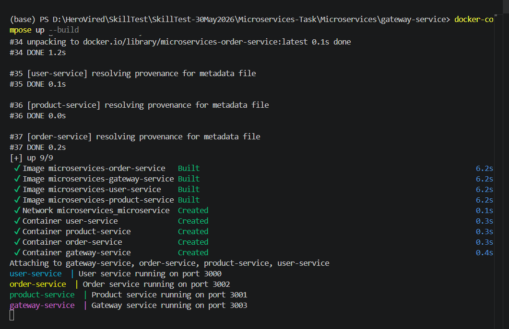

- **Docker Compose Active Processes**

  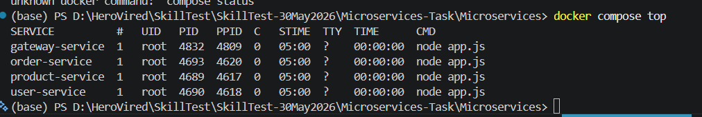
  
  _File:_ `Microservices/images/docker-compose-services-status.png` — shows `docker ps` / compose services listing.


- **Running container status**

  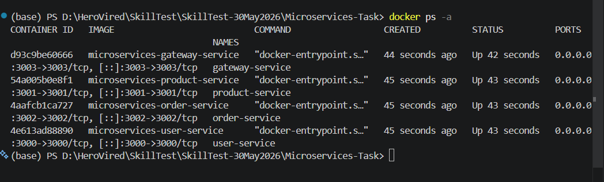
  
  _File:_ `Microservices/images/docker-service-status.png` — alternative view of running containers.

- **User endpoints (via gateway and direct)**

  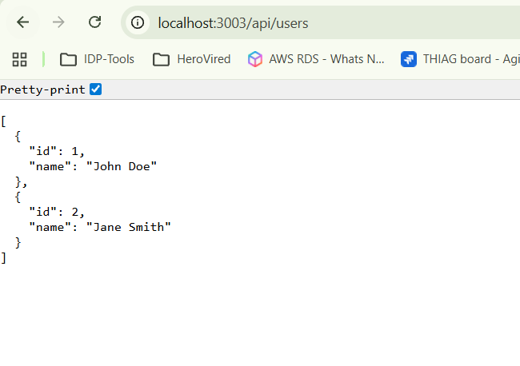
  
  _File:_ `Microservices/images/app-users-gateway-page.png` — response from `http://localhost:3003/api/users`.

  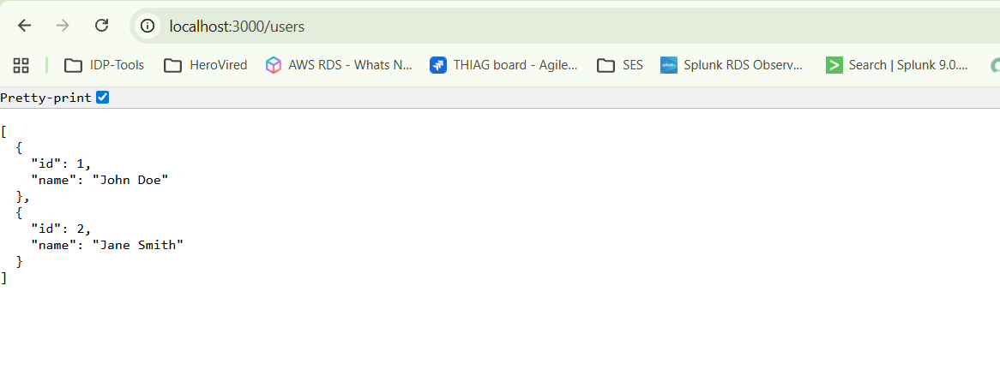
  
  _File:_ `Microservices/images/app-users-page.png` — response from `http://localhost:3000/users`.

- **Product endpoints**

  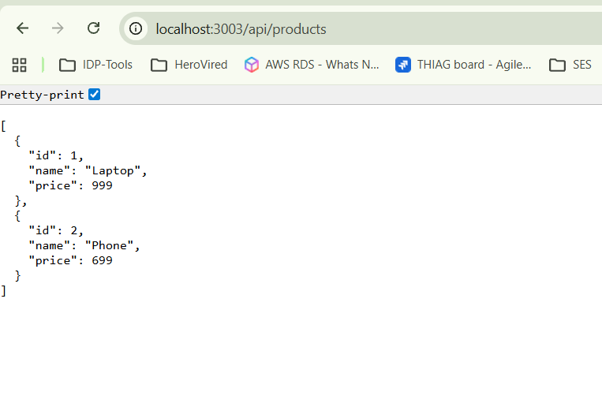
  
  _File:_ `Microservices/images/app-products-gateway-page.png` — response from `http://localhost:3003/api/products`.

  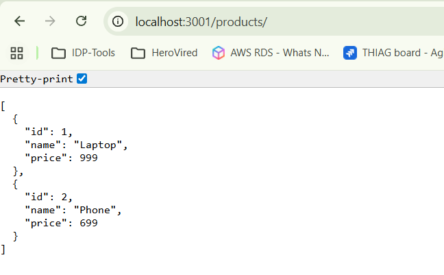
  
  _File:_ `Microservices/images/app-products-page.png` — response from `http://localhost:3001/products`.

- **Order endpoints and tests**

  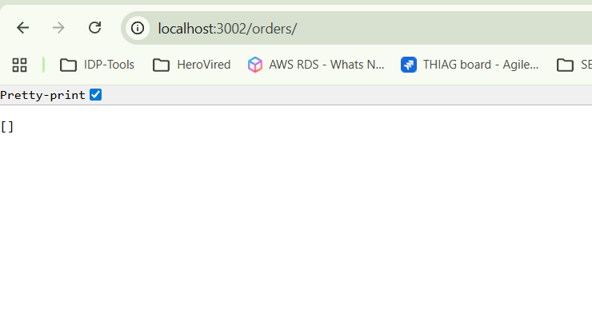
  
  _File:_ `Microservices/images/app-orders-page.png` — response from `http://localhost:3002/orders` (empty or with data).

  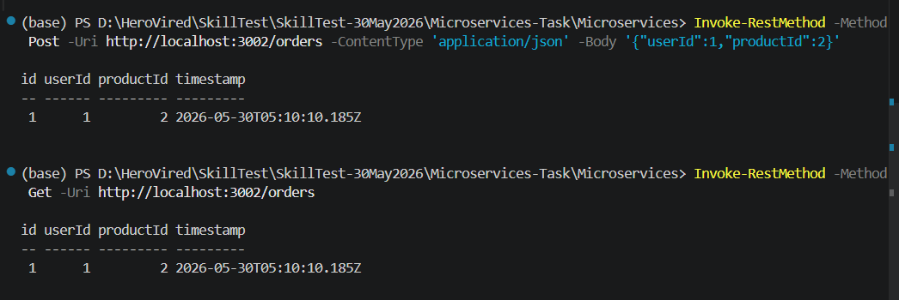
  
  _File:_ `Microservices/images/app-orders-test-order-creation.png` — shows a POST request creating an order.

  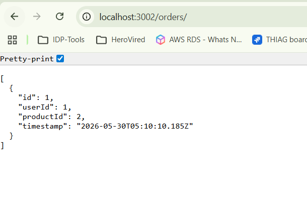
  
  _File:_ `Microservices/images/app-orders-data-page.png` — shows order details after creation.

- **Health pages**

  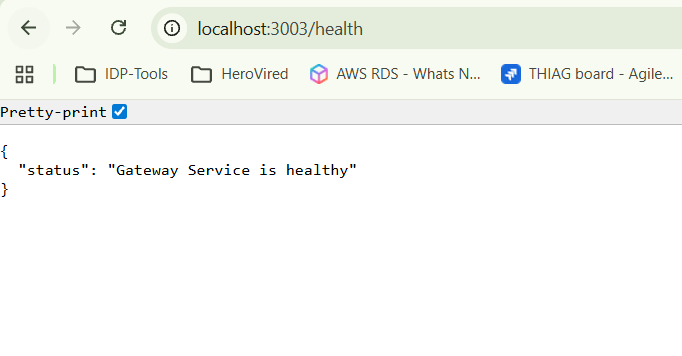
  
  _File:_ `Microservices/images/app-gateway-health-page.png` — `http://localhost:3003/health`.

  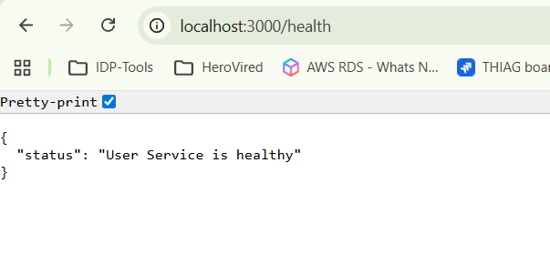
  
  _File:_ `Microservices/images/app-users-health-page.png` — `http://localhost:3000/health`.

  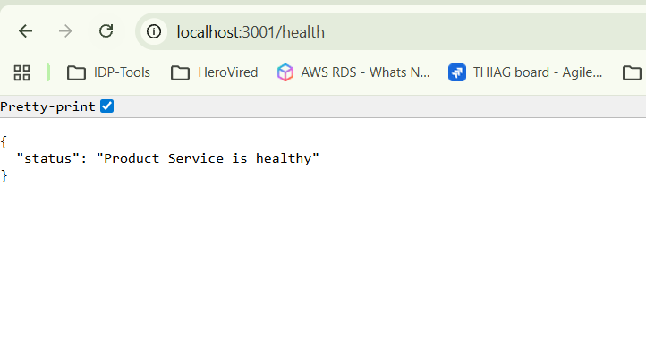
  
  _File:_ `Microservices/images/app-products-health-page.png` — `http://localhost:3001/health`.

  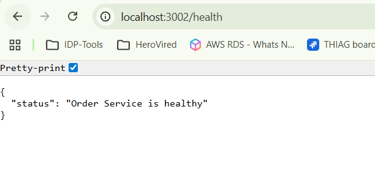
  
  _File:_ `Microservices/images/app-orders-health-page.png` — `http://localhost:3002/health`.


If you prefer the files under a different folder (for example `docs/screenshots`), I can move or duplicate them and update the links accordingly.