# Kubernetes Deployment

This repository contains the Kubernetes manifests to deploy a four-service Node.js microservice architecture in a local cluster using Docker Desktop's built-in Kubernetes. The resources are deployed inside the dedicated `tb-namespace` namespace.

---

## 1. Directory Structure

```text
Microservices-Task/
├── kubernetes/
│   ├── deployments/
│   │   ├── user-service.yaml
│   │   ├── product-service.yaml
│   │   ├── order-service.yaml
│   │   └── gateway-service.yaml
│   ├── services/
│   │   ├── user-service.yaml
│   │   ├── product-service.yaml
│   │   ├── order-service.yaml
│   │   └── gateway-service.yaml
│   ├── ingress/
│   │   └── ingress.yaml
│   └── screenshots/
│       └── [verification screenshots]
├── README.md
```

## 2. Setup and Deployment Steps

### Step 1: Cluster Context and Namespace Setup
Ensure your command line points to your Docker Desktop cluster:

```
bash
kubectl config use-context docker-desktop
```

Ensure the target namespace exists and is active:

```
bash
kubectl create namespace tb-namespace
```

### Step 2: Build Docker Images Locally
Since Docker Desktop runs on the same host Docker engine, images built locally are immediately available to the Kubernetes cluster without pushing to an external registry:

```
bash
docker build -t user-service:latest ./Microservices/user-service
docker build -t product-service:latest ./Microservices/product-service
docker build -t order-service:latest ./Microservices/order-service
docker build -t gateway-service:latest ./Microservices/gateway-service
```

### Step 3: Deploy YAML Manifests
Apply the Deployments, ClusterIP Services, and Ingress rules:

```
bash
# Apply Deployments
kubectl apply -f kubernetes/deployments/
# Apply ClusterIP Services
kubectl apply -f kubernetes/services/
# Apply Ingress configuration (Bonus)
kubectl apply -f kubernetes/ingress/ingress.yaml
```

## 3. Verification & Testing

### A. Monitor Pod & Service Health
Verify that all deployments are active and pods are in the Running state:

```
bash
kubectl get deployments -n tb-namespace
kubectl get pods -n tb-namespace
```

Verify that all internal ClusterIP services have been successfully created and exposed on the correct ports:

```
bash
kubectl get svc -n tb-namespace
```

### B. Validate Inter-Service Communication via Port Forwarding
Start a port-forwarding session to access the gateway-service locally:

```
bash
kubectl port-forward svc/gateway-service -n tb-namespace 3003:3003
```

In a separate terminal or browser, test the communication pathways through the gateway to internal services:

```
# Get Users
Invoke-RestMethod -Method Get -Uri "http://localhost:3003/api/users"
# Get Products
Invoke-RestMethod -Method Get -Uri "http://localhost:3003/api/products"
# Post a new Order
Invoke-RestMethod -Method Post -Uri "http://localhost:3003/api/orders" -ContentType "application/json" -Body '{"userId": 1, "productId": 2}'
```

## 4. Bonus Task: Ingress Configuration

### Step 1: Deploy Ingress Controller

Deploy NGINX Ingress Controller for cloud/desktop environments:

```
bash
kubectl apply -f https://raw.githubusercontent.com/kubernetes/ingress-nginx/main/deploy/static/provider/cloud/deploy.yaml
```

Wait until the controller pods reach the Ready state:

```
bash
kubectl wait --namespace ingress-nginx --for=condition=ready pod --selector=app.kubernetes.io/component=controller --timeout=90s
```

### Step 2: Configure Hostname Map

Open C:\Windows\System32\drivers\etc\hosts as an Administrator and map the cluster loopback IP to our hostname:

```
text
127.0.0.1 tbmicroservices.local
```

### Step 3: Validate Routing via Hostname

Verify path routing directly through the hostname (bypassing the gateway service and invoking path-based rewrites to backend microservices):

```
powershell
# Hits User Service via Ingress rewriting /api/users to /users
curl http://tbmicroservices.local/api/users

# Hits Product Service via Ingress rewriting /api/products to /products
curl http://tbmicroservices.local/api/products

# Hits Order Service via Ingress rewriting /api/orders to /orders
curl http://tbmicroservices.local/api/orders

# Hits Gateway Service direct homepage
curl http://tbmicroservices.local/health
```

## 5. Troubleshooting Done

### 1. Port 80 conflict in WSL: 
If tbmicroservices.local returns a 404 Not Found with a signature like nginx/1.24.0 (Ubuntu), it means a standalone Nginx server inside WSL is hijacking port 80. Free it by running sudo service nginx stop inside your WSL console.

### 2. Missing Ingress Class: 
Ensure your ingress manifests define ingressClassName: nginx in their spec block, otherwise they will remain in a <none> class state and won't bind to an address.

---

## 6. Verification Screenshots

### A. Docker Images & Cluster Status

**Docker Desktop Images Status**
<p align="left">
  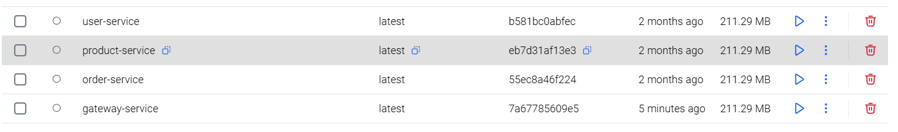
</p>

---

**Running Deployments**
<p align="left">
  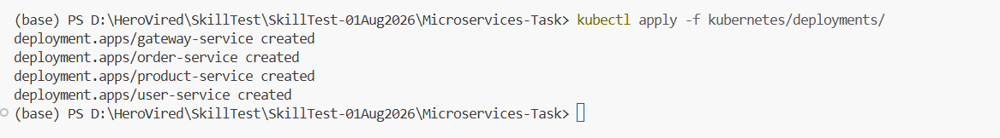
</p>

---

**Running Pods**
<p align="left">
  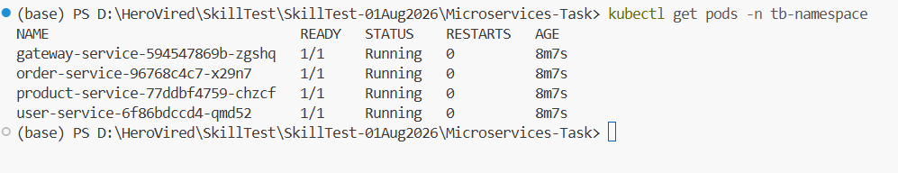
</p>

---

**Active Cluster Services**
<p align="left">
  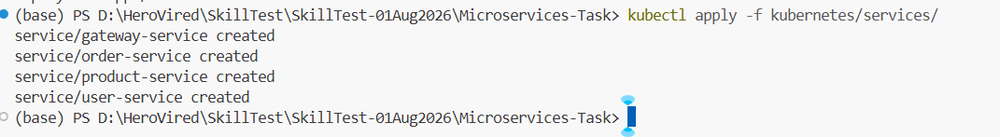
</p>

<br>

### B. Port-Forwarding & Local API Access

**Port-Forwarding Session**
<p align="left">
  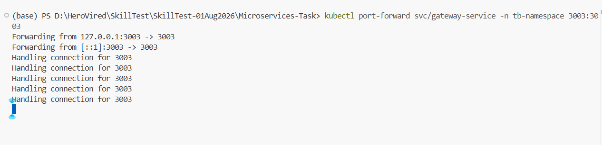
</p>

---

**User Service Access (Port-forward)**
<p align="left">
  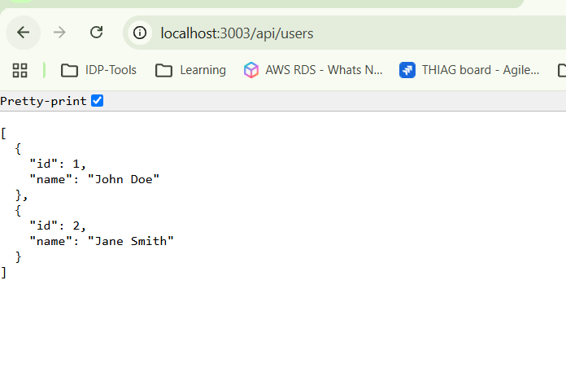
</p>

---

**Product Service Access (Port-forward)**
<p align="left">
  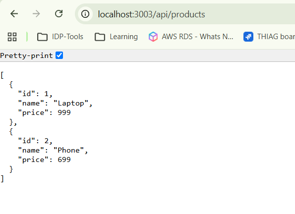
</p>

---

**Creating a New Order (Port-forward)**
<p align="left">
  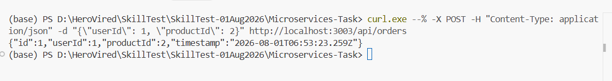
</p>

---

**Order Service Access (Port-forward)**
<p align="left">
  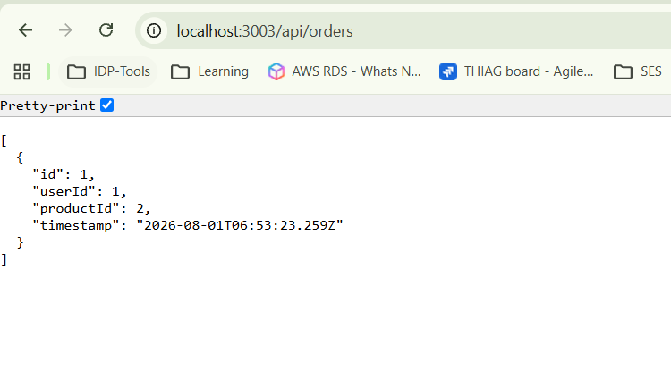
</p>

---

**All Service Log Output**
<p align="left">
  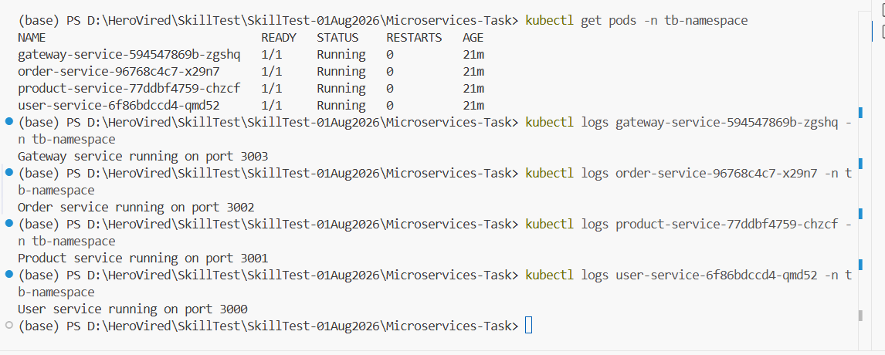
</p>

<br>

### C. Bonus Task: Ingress Controller & Domain Access

**Hosts File Configuration (`tbmicroservices.local`)**
<p align="left">
  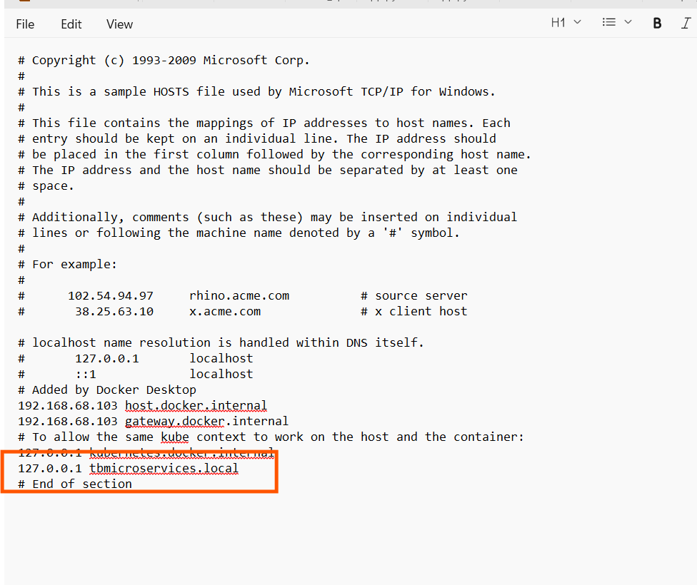
</p>

---

**NGINX Ingress Controller Pod Status**
<p align="left">
  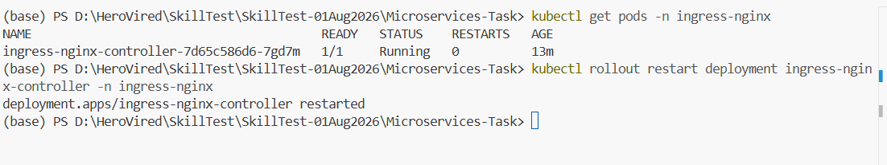
</p>

---

**NGINX Ingress Controller Service (LoadBalancer)**
<p align="left">
  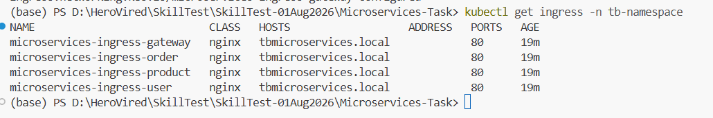
</p>

---

**Ingress Resources Deployment Status**
<p align="left">
  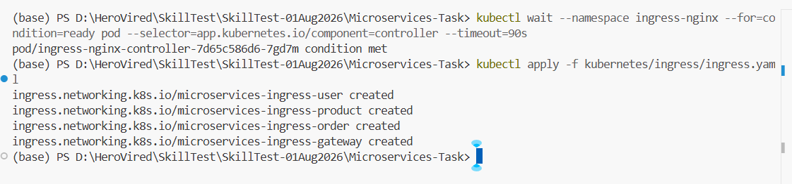
</p>

---

**User Service Ingress Domain Call**
<p align="left">
  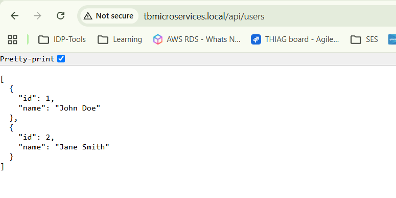
</p>

---

**Product Service Ingress Domain Call**
<p align="left">
  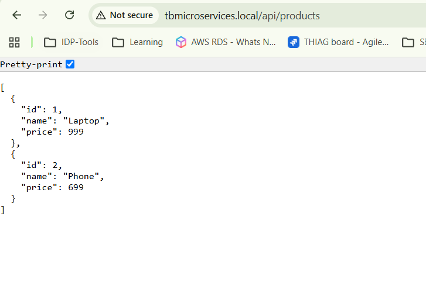
</p>

---

**Order Service Ingress Domain Call**
<p align="left">
  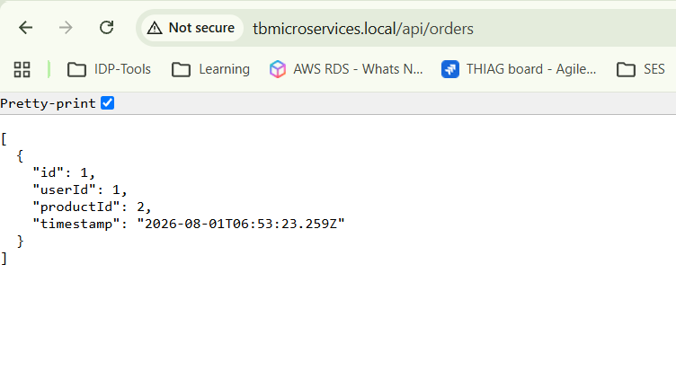
</p>